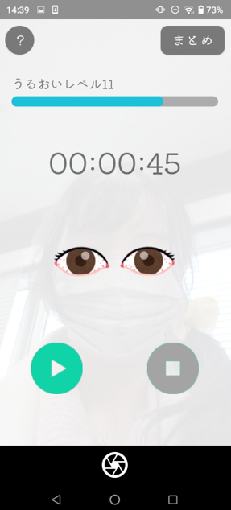

 # Blinking
 １年後期制作のAndroidアプリ 
 ３人でのグループ開発

## 概要
ドライアイ防止アプリ 
顔検知(ML Kit)を用いて、ユーザーが長時間目を開いていたらフラッシュをまばたきをさせる 
フォードバックもある

youtubeリンク：https://youtu.be/mmFWhVchnQk

## 使用したもの
使用言語：Java 
使用技術：ML Kit 
開発環境：AndroiStudio　ドルフィン 

## 成果
埼玉ICTコンテスト2023　プログラミング部門最優秀賞受賞

コンテストサイト：https://www.sisia.or.jp/homepage-contest/index2023.html

